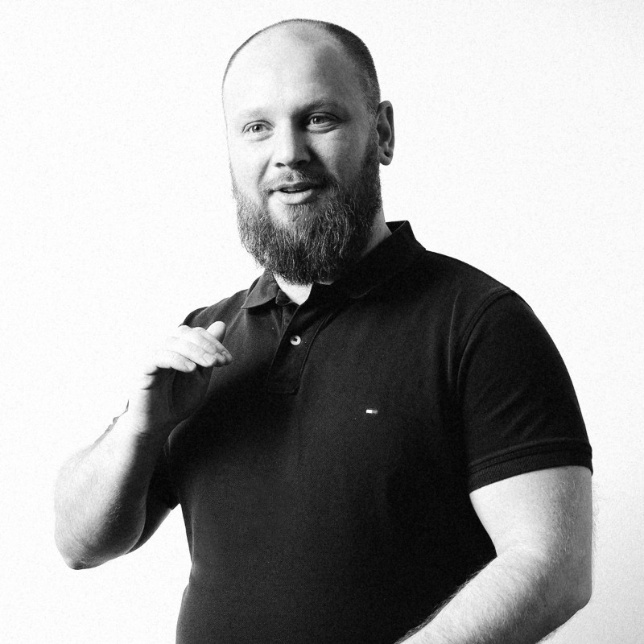

# Daniel Antonio Tala de Dompierre de Chaufepie 
BSE CS, ML Ops Engineer

- 36 years old, Chilean
- Currently based in Copenhagen
- Phone: [+4552755971](tel:+4552755971)
- Email: [daniel.talaman@gmail.com](mailto:daniel.talaman@gmail.com)
- Website: [https://talaman.info](https://talaman.info)
- LinkedIn: [https://www.linkedin.com/in/danieltala](https://www.linkedin.com/in/danieltala)

## PERSONAL STATEMENT

As a software and machine learning engineer with 15 years of experience, I specialize in MLOps and designing scalable solutions. With a passion for problem-solving, I'm dedicated to overcoming technical challenges and ensuring smooth production. As an adventurer with a global perspective, I've lived in eight countries and traveled to 36, gaining valuable insights and a unique appreciation for diverse cultures.

## SKILLS AND EXPERIENCE

Experienced in ML Ops engineering, AI, software development, and project management, with a Bachelor's degree in Computer Science and Engineering, an MBA, and various certifications in Machine Learning, DevOps, and IoT. Fluent in English and Spanish with a basic understanding of Danish. Worked as an MLOps Engineer for TDC Net in Denmark and as an AI Specialist for Republica. Also served as a Senior Software Engineer for Kairos in Chile and a Principal Consultant in Software Factory for Talaman.

## PERSONAL INTERESTS

Passionate about family, nature, and animals. Committed to lifelong learning, social responsibility, and embracing a global mindset. Enjoys traveling, hiking, electric longboarding, and 3D printing.

## EDUCATION

- MLOps, DeepLearning.AI, 2022.
- Machine Learning, MITx, 2021.
- DevOps, The Linux Foundation, 2017.
- Internet of Things, MITx, 2017.
- AWS Developer, AWS, 2018.
- PGD Business Intelligence, IEDE Business School, 2014.
- MBA, IEDE Business School, 2017.
- Bachelor of Computer Science and Engineering, Aiep UNAB, 2014.
- PGD Executive Management, Universidad N. Andrés Bello, 2016.
- Project Management, University of California, Riverside Extension, 2016.
- English Language (Academic), NZ Unitec Institute of Technology, 2018.
- English Language, Kaplan Oxford, 2014.
- Danish Language 3.2, UCPlus, 2021.
- Technician in Computer Science, Universidad ICEL, Mexico, 2009.

## RELEVANT WORK HISTORY

### MLOps engineer, TDC net (tdcnet.dk), Denmark. 3/2022-Present

Developing and implementing ML pipelines, Kubeflow, Kubernetes, MLflow, Argo, Terraform, and MLOps practices for the Advanced Analytics and AI team. Building CI/CD/CT pipelines to streamline deployment. Creating APIs, microservices, and apps to capture and label data. Ensuring the scalability and reliability of data science solutions through robust MLOps methodologies.

### AI Specialist, Republica (republica.dk), Denmark. 11/2018-3/2022

Designing AI solutions to automate business processes and architect microservice systems. Developing mechanisms to capture data, train ML models, and perform automation and retraining pipelines. Prototyping and developing full-stack applications, and implementing DevOps with CI/CD and queue systems.

### Senior Software Engineer, Kairos (kairoschile.cl), Chile. 6/2015-7/2017

As the lead software architect and advisor, designed strategic plans for product enhancement and achievement.

### Principal Consultant, Talaman (cl.talaman.info), Chile. 2011-2015

Customizing techniques and processes to meet customers' requirements and ensure successful implementation. Possessing strong team formation and people management skills. Designing creative solutions for complex technical needs.

### Analyst Developer, I2K Consultores, Chile. 2010-2011

Scaling multinational systems across diverse technologies and developing using SOA architecture.

### Computer Technician, Self-employed, Mexico. 2006-2009

Assembling computers and providing technical support.

## My stack of interest includes

Kubernetes, Kubeflow, BentoML, LangChain, Grafana, Tensorflow, PyTorch, IoT, Python, React Native, and using Terraform and YAML for IaC and automation.

I'm skilled in DevOps, MLOps and LLMOps, Kubeflow, Kubernetes, Docker, Grafana, Vertex AI, Azure, AWS, Databricks, Snowflake, kfp, MLFlow, Tensorflow, PyTorch, JavaScript, Python, React, React Native, C#, SQL, YAML, Terraform and Terragrunt, BI, microservices architecture, and more.

## LANGUAGES

- English, C2 Proficiency.
- Spanish, Native.
- Danish, A2.

## REFERENCES

Søren Michael Nielsen, Senior Engineering Manager, Maersk.
LinkedIn: smnie
Phone: +45 40 19 35 25

Per M. Butschkow, IT-udviklingschef, Københavns Universitet.
LinkedIn: butschkow
Phone: +45 20 11 77 97

